### 一、什么是AEM

**官方给出的解释是**
Adobe Experience Manager (AEM) is a comprehensive content management solution for building websites, mobile apps, and forms. AEM makes it easy to manage your marketing content and assets.

**基于个人的理解**

AEM (Adobe Experience Manager) 是一个基于经验证、可扩展且灵活的技术构建的强大平台，它是一个现代的内容管理系统，依赖于标准的Web技术，如HTML、CSS和JavaScript，并且底层内容存储库和业务逻辑层是围绕Java技术构建的。AEM使用Java Content Repository (JCR) 作为其内容存储标准，并且集成了Apache Jackrabbit Oak作为JCR的高性能实现。AEM还使用Sling，这是一个基于REST原则的Web应用程序框架，用于构建面向内容的应用程序,主要用作与创建以及维护和部署一些大型的商用网站拥有以下几大特点。

* 组件化开发：大部份的厂商一般都是一次性开发好网站的所有内容包括功能，一般以页面为单位，同时管理者只能通过B端来编辑对应的数据在展示到C端上。而AEM具有一定的逻辑代码的最小单元是组件。首先AEM会给我们提供一些常用的基础组件如面包屑、图片、富文本编辑等组件，同时开发者也可以自定义开发组件。

* 数据库：传统的CMS系统一般是依赖MySql等数据库来存储，AEM截然不同次采用文档型数据库（JCR）进行存储。结构如下。

  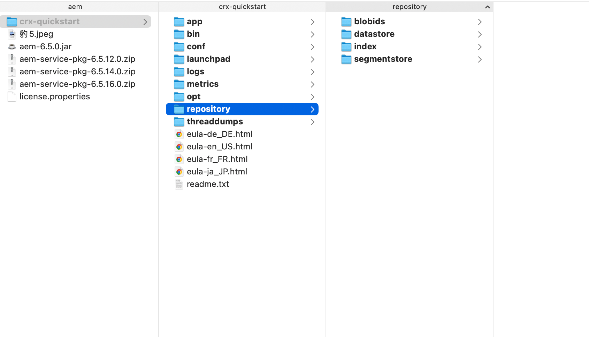

* 灵活性：普通的网站需要我们在B端进行编辑对应的数据然后保存到数据库后，最终内容才能呈现在C端上，而AEM所见及所得可以直接在我们组件上进行编辑更改文案等数据，并且可以直观的看到效果。

*   常用场景：

    1. 网站管理和内容管理：

         *   创建和管理网站的各种内容，包括页面、图片、视频、文档等。
         *   使用模板和组件来设计布局网站页面。
         *   管理多语言和多渠道的内容。

    2.  数字资产管理：
        * 管理和组织数字资产，例如图像、视频、音频等。
        * 提供搜索、标记、版本控制等功能来管理大量的数字资产。
    3.  个性化和体验管理：
        * 根据用户的行为和属性提供个性化的内容和体验。
        * 进行A/B测试和多变量测试以优化用户体验。
    4. 数字营销和营销自动化：
       * 创建和管理营销活动的内容和资产。
       * 跟踪和分析营销活动的效果，以便优化营销策略。
    
    5. 电子商务集成：
       * 与电子商务平台集成，管理产品信息、目录和订单。 
       * 提供电子商务功能，如购物车、支付集成等。 

### 二、AEM技术架构

#### 1、AEM三大核心分层和三大核心技术架构图

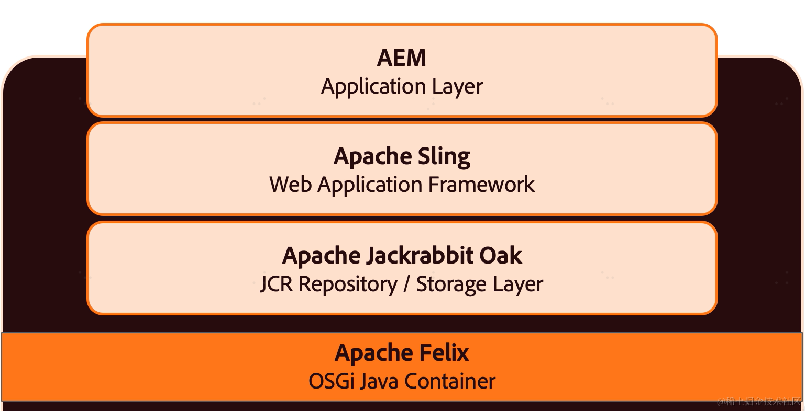

**应用层：**在AEM中，应用层包含了处理业务逻辑和提供功能的部分。应用层包括了AEM中的组件、服务和工作流程，用于处理用户请求、执行操作和与其他系统交互。包括了个性化体验、探索和检索、工作流程管理、电子邮箱营销等。

**Web层：**Apache Sling是一个内容驱动的Web应用构建框架。基于REST原则，使用资源路径来映射HTTP请求到特定的处理器。在Apache Sling中内容被视为资源，每个资源都有一个以为的路径和一组属性。借助Sling提供的HTL（sightly）语言解析引擎。可以在html中轻松的引入后台Sling Moddel，并使用HTL标签渲染model中的数据。
AEM中常用的Sling API:

- Resource API
  - ResourceResolver: 用于获取资源、创建资源
  - Resource: 表示AEM中的资源，包括页面、节点等，提供了获取资源路径、属性、子资源等信息的方法。
  - ResourceResolverFactory: 用于创建和获取`ResourceResolver`的实例工厂类。
- Request Processing API
  - SlingHttpServletRequest: 表示Sling中的http请求，提供了获取请求参数、属性、资源等信息的方法。
  - SlingHttpServletResponse: 表示Sling中的http响应，提供了设置响应状态、头部、内容等信息的方法。
  - Servlet: 用于处理http请求的servlet接口，通常需要继承改接口实现`doGet`、`doPost`等方法。
- Adaptable API
  - Adaptable: 表示可适配的对象，即可以将其适配成不同类型的对象
  - AdaptableFactory: 用于创建和获取适配器的工厂类。
  - AdaptableServlet: 一个特殊的Servlet,可以从请求中适配资源或其他对象
- JCR API
  - Session: 表示与JCR存储卡的回话，用于执行JCR操作，如读取、写入、更新等
  - Node和Property: 表示JCR中的节点和属性，提供了获取和操作节点、属性的方法
- 其他API
  - SlingSettingsService: 用于获取Sling的配置信息和运行时状态
  - ResourceChangeListener: 用于监听资源变化事件，如节点添加、更新和删除等。
  - ScriptHelper: 用于在脚本中执行Java代码的助手类。


**数据层(Apache Jackrabbit Oak)：** AEM是以 Java Content Repostory(JCR)这个java内容仓库规范作为数据存储模型，它提供了一种层次化的数据存储和检索机制。数据层包括了存储在CRX中的所有内容，例如网站页面、数字资产、配置数据等。

#### 2、AEM需要掌握的三大核心技术

(1) Apache Sling （Web application FrameWork）

(2) Java JCR &amp; Apache Jackrabbit （JCR的一个实现 https://jackrabbit.apache.org/jcr/jackrabbit-architecture.html）

(3) Apache Felix （OSGI的一个实现 http://felix.apache.org/）

#### 3、AEM渲染层模板语言：HTL

HTML 模板语言 (HTL) 是 Adobe Experience Manager 中适用于 HTML 的首选和推荐的服务器端模板系统。 像在所有 HTML 服务器端模板系统中一样，HTL 文件通过指定 HTML 本身、一些基本的表示逻辑和要在运行时计算的变量来定义发送到浏览器的输出。

#### 4、相关官网学习文档

*   Adobe Experience Manager6.5文档：[https://experienceleague.adobe.com/docs/experience-manager-65.html?lang=zh-Hans](https://experienceleague.adobe.com/docs/experience-manager-65.html?lang=zh-Hans)
*   Adobe Experience Manager as a Cloud Service文档：[https://experienceleague.adobe.com/docs/experience-manager-cloud-service.html?lang=zh-Hans](https://experienceleague.adobe.com/docs/experience-manager-cloud-service.html?lang=zh-Hans)
*   Core Components Introduction：[https://experienceleague.adobe.com/docs/experience-manager-core-components/using/introduction.html?lang=zh-Hans](https://experienceleague.adobe.com/docs/experience-manager-core-components/using/introduction.html?lang=zh-Hans) 

### 三、开发前准备事项

由于AEM是Adobe面向企业的不对个人免费开发，相关资料只能从Adobe公司获取。

#### 1、环境搭建相关依赖

- 开发工具：推荐使用IDEA

   下载地址：https://www.jetbrains.com/idea/download/#section=windows

* 开发环境

  > JDK 目前仅支持11以下的JDK版本
  >
  > Maven 3.3.9以上	

   JVAV JDK11： https://cfdownload.adobe.com/pub/adobe/coldfusion/java/java11/java11018/jdk-11.0.18_windows-x64_bin.exe
  
   Maven https://dlcdn.apache.org/maven/maven-3/3.9.6/binaries/apache-maven-3.9.6-bin.zip

更多环境配置请参考[WKND项目原型快速入门](https://experienceleague.adobe.com/zh-hans/docs/experience-manager-learn/getting-started-wknd-tutorial-develop/project-archetype/overview)

#### 2、获取AEM实例

*   1、获取启动jar包（aem-6.5.0.jar) 和 license文件（license.properties）
*   2、在合适的目录下新建一个文件夹，在此文件夹里放入我们的启动jar包和license文件。
*   3、启动aem服务 (java -jar aem-6.5.0.jar), 启动过程中会提示输入用户名、密码。建议默认都使用`admin`

###  四、AEM 门户介绍

1、进程结束后会自动运行在默认浏览器上，端口号是默认的4502，网址：http://localhost:4502/aem/start.html 账号密码都是admin。 


2、UI Manager是AEM的核心控制台主要提供了一些页面管理（页面的创建和编辑），资产管理（图片视频等素材），UI控制台是运维人员和AEM管理员的主要控制台。 

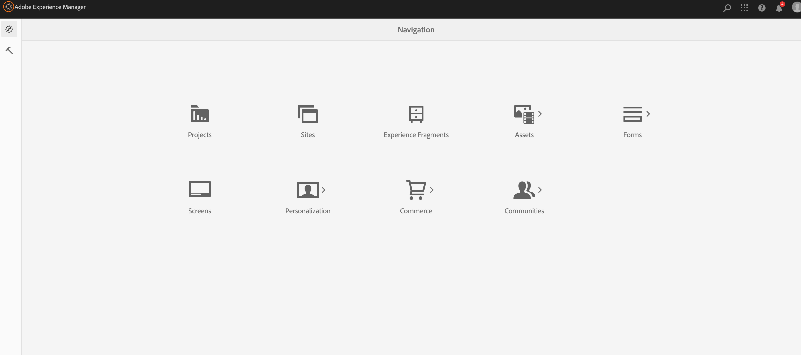

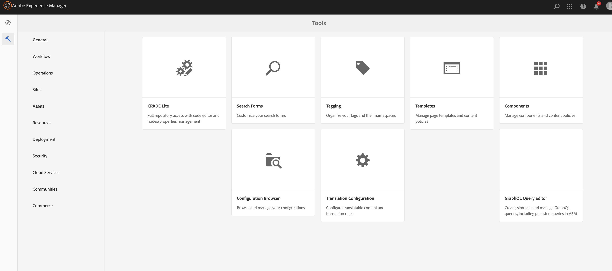

3、Crx/de控制台 http://localhost:4502/crx/de/index.jsp
`Crx/de控制台`可以被说为是`数据库管理工具`主要用来查看JCR的底层数据，同时包括我们的AEM代码，以及用户创建的页面添加的组件及对应的信息内容。可以说整个数据都可以在这里查看的到，在这里进行修改都会立即生效。 

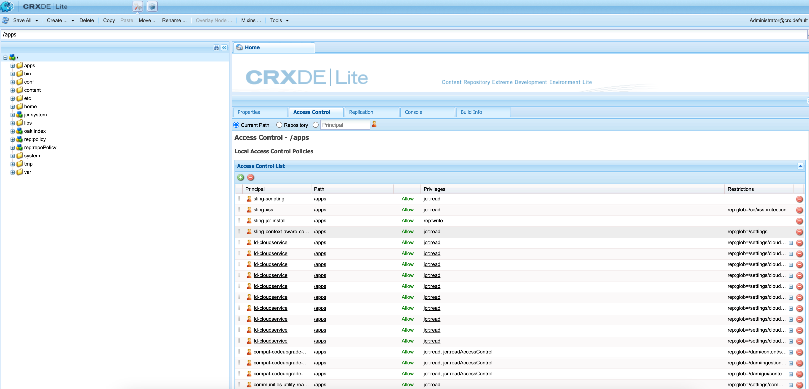


4、根据公司需求可能会需要额外配置一些站点相关包

例如一些工程编译包、数据包、资产包、权限组包。需要我们进入 http://localhost:4502/crx/packmgr/index.jsp 对相关的包进行解析。包括安装、卸载等等。

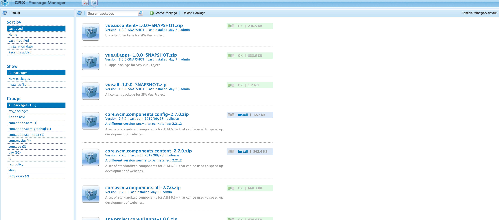

5、explorer控制台 http://localhost:4502/crx/explorer/index.jsp

explorer控制台不是很常用，核心功能是配置系统级用户，系统级用户是，在AEM的权限管理中，所有操作JCR数据必须要有一个用户，我们在Java中使用API操作JCR也不例外，因此需要为我们的java代码分配一个用户，而直接在Touch UI中创建用户，安全性低并且还需要密码认证，所以我们一般在该控制台中创建一个为代码使用的系统级用户。

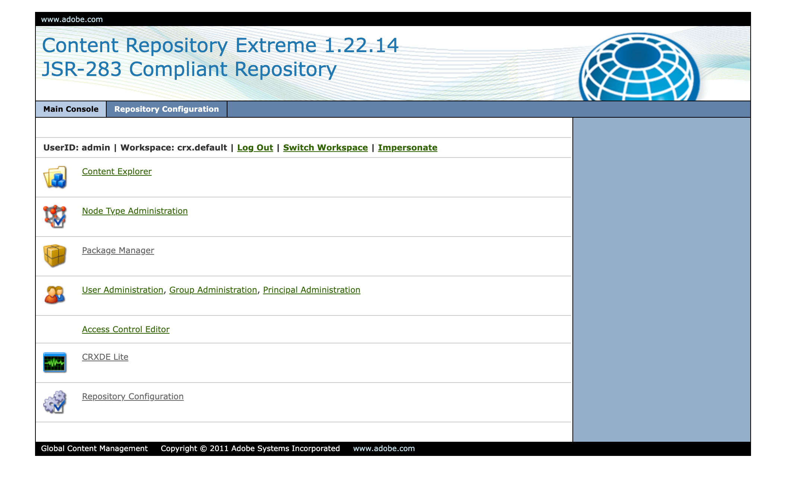

6、Web Console http://localhost:4502/system/console/bundles

可以查看bundles的状态，日志(http://localhost:4502/system/console/slinglog)等等。

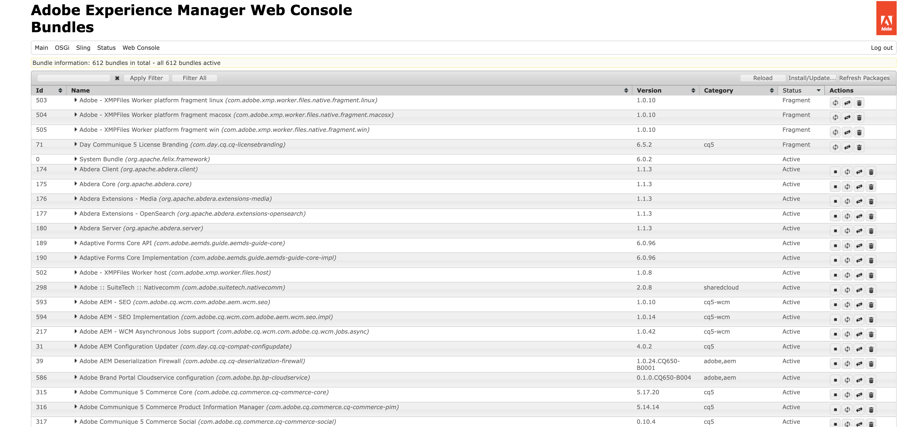

### 五、AEM 开发入门 - WKND

[WKND教程](https://experienceleague.adobe.com/zh-hans/docs/experience-manager-learn/getting-started-wknd-tutorial-develop/overview)是一个专为不熟悉AEM开发人员设计的的教程。该教程介绍了虚拟生活方式品牌WKND的AEM站点的实施。 该教程涵盖了项目设置、核心组件、可编辑模板、客户端库和使用 Adobe Experience Manager Sites 进行组件开发等基本主题。

#### 1、初始化项目

- 进入代码文件夹

  ```shell
  mkdir ~/aem && cd ~/aem 
  ```

- 生成项目

  ```shell
  mvn -B org.apache.maven.plugins:maven-archetype-plugin:3.2.1:generate \
      -D archetypeGroupId=com.adobe.aem \
      -D archetypeArtifactId=aem-project-archetype \
      -D archetypeVersion=39 \
      -D appTitle="WKND Sites Project" \
      -D appId="wknd" \
      -D groupId="com.adobe.aem.guides" \
      -D artifactId="aem-guides-wknd" \
      -D package="com.adobe.aem.guides.wknd" \
      -D version="0.0.1-SNAPSHOT" \
      -D aemVersion="cloud"
  ```

  > 要将AEM 6.5.14+作为目标，请替换 `aemVersion="cloud"` 替换为 `aemVersion="6.5.14"`.
  >
  > maven仓库并没有6.5.14该版本，请使用其他版本。本次使用版本`6.5.0`

- 以下结构目录是Maven原型生成

  > └── aem-guides-wknd
  >     ├── LICENSE
  >     ├── README.md
  >     ├── all
  >     ├── archetype.properties
  >     ├── core
  >     ├── dispatcher
  >     ├── it.tests
  >     ├── pom.xml
  >     ├── ui.apps
  >     ├── ui.apps.structure
  >     ├── ui.config
  >     ├── ui.content
  >     ├── ui.frontend
  >     └── ui.tests


#### 2、部署项目

- 确保本地AEM实例运行在`4502`

- 进入到aem-guides-wknd目录`cd aem-guides-wknd`

- 部署项目到AEM实例 `mvn clean install -PautoInstallSinglePackage` 

  Maven配置文件 `autoInstallSinglePackage` 编译项目的各个模块并将单个包部署到AEM实例。 默认情况下，此包将部署到本地在端口上运行的AEM实例 **4502** 并且具有 `admin:admin`

  > 构建完成后会显示以下信息
  >
  > [INFO] Reactor Summary for WKND Sites Project 0.0.1-SNAPSHOT:
  > [INFO]
  > [INFO] WKND Sites Project ................................. SUCCESS [  0.625 s]
  > [INFO] WKND Sites Project - Core .......................... SUCCESS [ 11.322 s]
  > [INFO] WKND Sites Project - UI Frontend ................... SUCCESS [ 20.674 s]
  > [INFO] WKND Sites Project - Repository Structure Package .. SUCCESS [  1.235 s]
  > [INFO] WKND Sites Project - UI apps ....................... SUCCESS [  3.407 s]
  > [INFO] WKND Sites Project - UI content .................... SUCCESS [  1.597 s]
  > [INFO] WKND Sites Project - UI config ..................... SUCCESS [  0.202 s]
  > [INFO] WKND Sites Project - All ........................... SUCCESS [  1.398 s]
  > [INFO] WKND Sites Project - Integration Tests ............. SUCCESS [ 17.256 s]
  > [INFO] WKND Sites Project - Dispatcher .................... SUCCESS [  0.283 s]
  > [INFO] WKND Sites Project - UI Tests ...................... SUCCESS [  0.221 s]
  > [INFO] ------------------------------------------------------------------------
  > [INFO] BUILD SUCCESS
  > [INFO] ------------------------------------------------------------------------
  > [INFO] Total time:  01:01 min
  > [INFO] Finished at: 2024-06-11T14:34:58+08:00
  > [INFO] ------------------------------------------------------------------------

- 导航到本地AEM实例上的包管理器： http://localhost:4502/crx/packmgr/index.jsp. 

  搜索`aem`会看到以下内容的包 `aem-guides-wknd.ui.apps`、 `aem-guides-wknd.ui.config`、 `aem-guides-wknd.ui.content`和 `aem-guides-wknd.all`.

- 导航到站点控制台： http://localhost:4502/sites.html/content. 可以看到`WKND Sites Project`站点。

- 打开 **us>en** 选择页面并单击 **编辑** 菜单栏中的按钮, 会跳转到en的编辑页面

  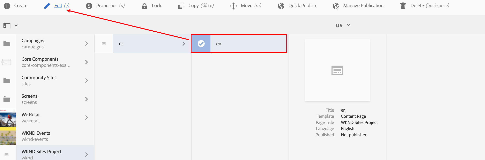

- 跳转的页面会显示正常的页面内容。

  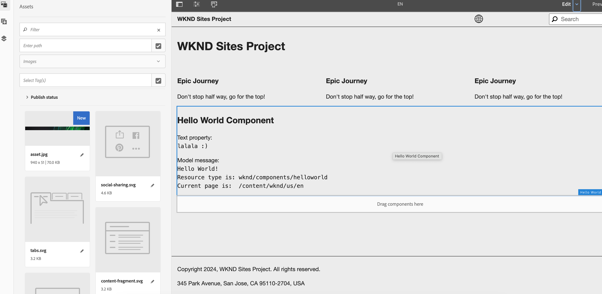

  如果页面显示为空，可以切换到edit到developer模式，查看是否报错。出现报错的原因，可能Sling等版本的原因。需要安装更高版本的Service Package。可以去[包管理](http://localhost:4502/crx/packmgr/index.jsp)页面安装更高版本的补丁。

  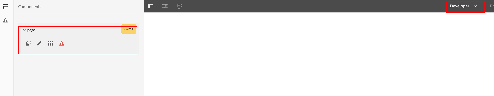

  当然也可以去[Web console](http://localhost:4502/system/console/bundles)下查看所有的bundles是不是**active**。

  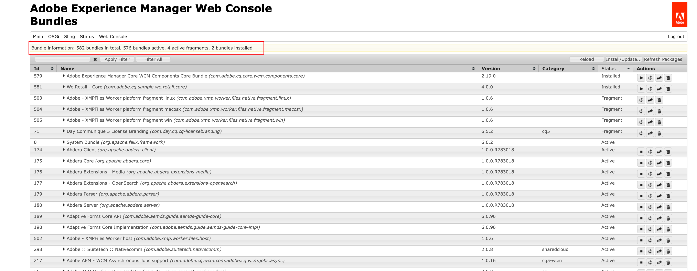

​			

#### 3、项目模块介绍

生成的AEM项目由单独的Maven模块组成，每个模块具有不同的角色。 本教程和大多数开发都侧重于以下模块：

- [core](https://experienceleague.adobe.com/zh-hans/docs/experience-manager-core-components/using/developing/archetype/using) - Java代码(包括开发servlet、filter、model等等)，主要是后端开发人员。

- [ui.frontend](https://experienceleague.adobe.com/zh-hans/docs/experience-manager-core-components/using/developing/archetype/front-end) — 包含CSS、JavaScript、Sass、TypeScript的源代码，主要适用于前端开发人员。

- [ui.apps](https://experienceleague.adobe.com/zh-hans/docs/experience-manager-core-components/using/developing/archetype/using) — 包含组件和对话框定义，将编译的CSS和JavaScript作为客户端库嵌入。

- [ui.content](https://experienceleague.adobe.com/zh-hans/docs/experience-manager-core-components/using/developing/archetype/using) — 包含结构化内容和配置，如可编辑模板、元数据架构。

- **all** — 这是一个空的Maven模块，它将上述模块组合到一个可以部署到AEM环境的包中。

  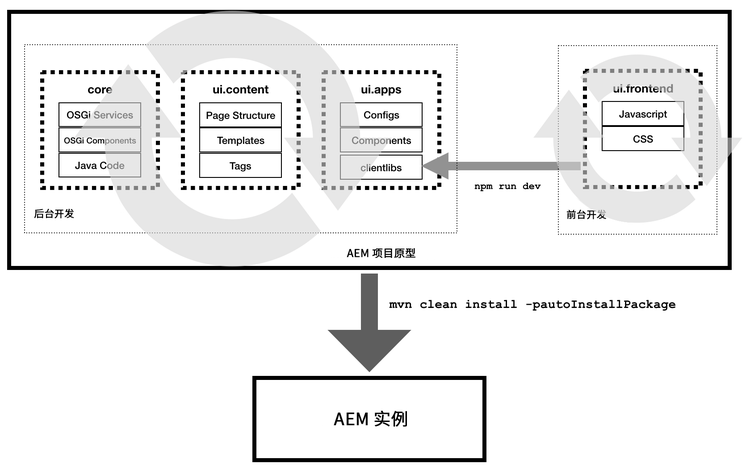

所有模块的介绍参考：https://experienceleague.adobe.com/zh-hans/docs/experience-manager-core-components/using/developing/archetype/using

#### 4、组件开发

在Adobe Experience Manager (AEM)中开发自定义组件是一个涉及多个步骤的过程，主要包括以下几个关键环节：

1. **理解组件结构**：AEM的组件通常位于`/apps/components`路径下。每个组件都有自己的结构，包括HTL（HTML Template Language）模板、Sling模型、CSS样式和JavaScript脚本。

2. **创建组件结构**：首先，在`/apps/components`下创建一个新的文件夹，例如`custom`，然后在该文件夹下创建组件的各个文件。通常，你需要创建以下文件：
   - `.content.xml`：定义组件的Sling模型和属性。
   - `.html`：HTL模板文件，用于定义组件的HTML结构。
   - `_cq_dialog/.content.xml`：用于定义组件对话（即编辑器界面）的文件。

3. **开发Sling模型**：Sling模型是Java类，用于定义组件的业务逻辑。它们可以是POJOs（Plain Old Java Objects）或基于Annotations的模型。

4. **编写HTL模板**：使用HTL语言编写模板，它将用于渲染组件的HTML。HTL提供了一种声明式的方式来绑定数据和渲染组件。

5. **样式和脚本**：为组件添加CSS样式和JavaScript脚本，以确保它们在网页上正确显示和行为。

6. **测试组件**：在AEM的编辑器和预览模式下测试组件，确保它们按预期工作。

7. **部署组件**：将开发完成的组件部署到AEM实例中。

默认情况下，当我们编辑en页面时，会显示如下。我们对**Hello World组件**进行编辑来模拟开发新的业务组件。

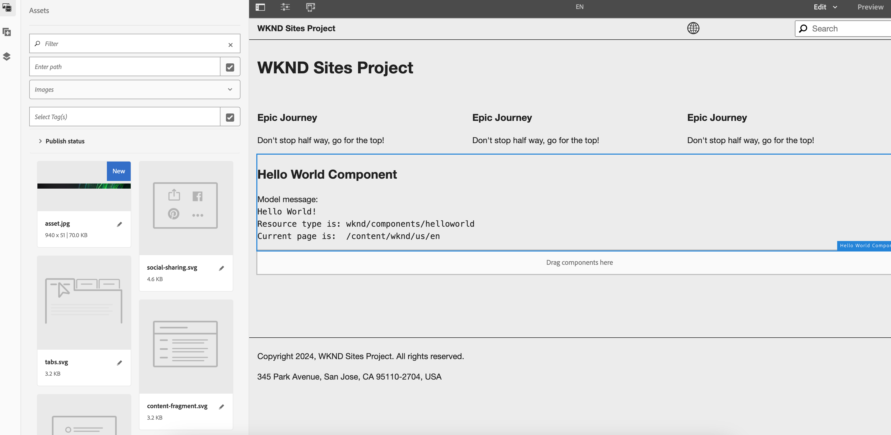


##### 1、新增title属性

修改helloworld组件下的_cq_dialog的**.content.xml**, 添加**title**属性。

```xml
<?xml version="1.0" encoding="UTF-8"?>
<jcr:root xmlns:sling="http://sling.apache.org/jcr/sling/1.0" xmlns:cq="http://www.day.com/jcr/cq/1.0" xmlns:jcr="http://www.jcp.org/jcr/1.0" xmlns:nt="http://www.jcp.org/jcr/nt/1.0"
    jcr:primaryType="nt:unstructured"
    jcr:title="Properties"
    sling:resourceType="cq/gui/components/authoring/dialog">
    <content
        jcr:primaryType="nt:unstructured"
        sling:resourceType="granite/ui/components/coral/foundation/fixedcolumns">
        <items jcr:primaryType="nt:unstructured">
            <column
                jcr:primaryType="nt:unstructured"
                sling:resourceType="granite/ui/components/coral/foundation/container">
                <items jcr:primaryType="nt:unstructured">
                  	<!--     新添加 title属性               -->
                    <title
                            jcr:primaryType="nt:unstructured"
                            sling:resourceType="granite/ui/components/coral/foundation/form/textfield"
                            fieldLabel="Title"
                            name="./title"/>
                    <text
                        jcr:primaryType="nt:unstructured"
                        sling:resourceType="granite/ui/components/coral/foundation/form/textfield"
                        fieldLabel="Text"
                        name="./text"/>
                </items>
            </column>
        </items>
    </content>
</jcr:root>
```

并在**helloworld.html**中添加title属性。

```html
 <h2 class="cmp-helloworld__title">${properties.title}</h2>
```

重新部署(`mvn clean install -PautoInstallSinglePackage`), 我们重新编辑该组件，弹窗中显示了title，我们输入任意的内容保存。

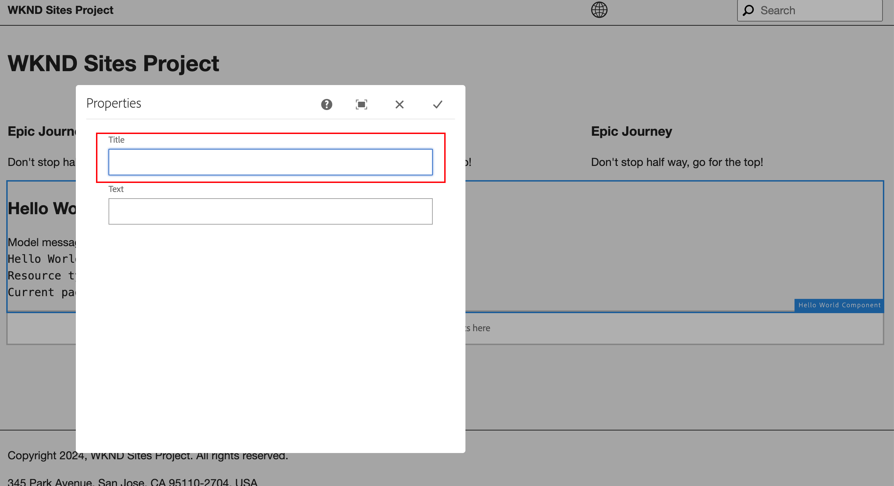

保存后页面的内容也同步更新了。

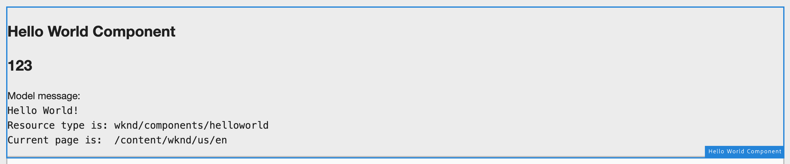

##### 2、新增Sling属性

我们在`com.adobe.aem.guides.wknd.core.models.HelloWorldModel`中添加name属性。

```java
private String name;

public String getName() {
    if (name == null) {
        return "default";
    }
    return name;
}
```

并在**helloworld.html**中添加model中的name。

```html
<div class="cmp-helloworld__item" data-sly-use.model="com.adobe.aem.guides.wknd.core.models.HelloWorldModel" data-sly-test="${model.name}">
    <p class="cmp-helloworld__item-label">Model name:</p>
    <pre class="cmp-helloworld__item-output" data-cmp-hook-helloworld="model">${model.name}</pre>
</div>
```

重新部署(`mvn clean install -PautoInstallSinglePackage`), 我们重新编辑该组件，发现该组件显示了name的默认值**default**。

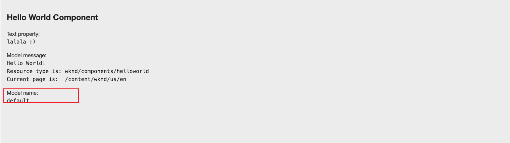

##### 3、修改页面元素样式

打开文件 `ui.frontend/src/main/webpack/components/_helloworld.scss`.

更新scss内容

```scss
.cmp-helloworld__title {
    color: red;
}
```

重新部署(`mvn clean install -PautoInstallSinglePackage`), 防线title颜色变红色。

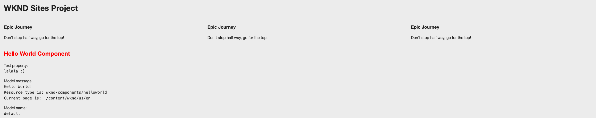

#### 5、AEM教程更多内容

- [页面和模版](https://experienceleague.adobe.com/zh-hans/docs/experience-manager-learn/getting-started-wknd-tutorial-develop/project-archetype/pages-templates)
- [客户端库](https://experienceleague.adobe.com/zh-hans/docs/experience-manager-learn/getting-started-wknd-tutorial-develop/project-archetype/client-side-libraries)
- [样式系统](https://experienceleague.adobe.com/zh-hans/docs/experience-manager-learn/getting-started-wknd-tutorial-develop/project-archetype/style-system)
- [自定义组件](https://experienceleague.adobe.com/zh-hans/docs/experience-manager-learn/getting-started-wknd-tutorial-develop/project-archetype/custom-component)
- [单元测试](https://experienceleague.adobe.com/zh-hans/docs/experience-manager-learn/getting-started-wknd-tutorial-develop/project-archetype/unit-testing)


### 六、AEM SPA开发入门 - Vue

单页应用程序 (SPA) 可以为网站用户提供引人入胜的良好体验。开发人员希望能够使用SPA框架构建站点，而创作者则希望能够在Adobe Experience Manager (AEM)中顺畅地为使用此类框架构建的站点编辑内容。

AEM当前支持`React`和`Angular`两种模式，我们在gh找到了适用用vue的库(https://github.com/saamoff/vue-aem.git)。

##### 1、定义组件

在ui.apps的components下创建组件`price-calculator`，文件结构如下。

> price-calculator
> ├── .content.xml
> ├── _cq_dialog
> │   └── .content.xml
> └── _cq_editConfig.xml

`.content.xml`内容

```xml
<?xml version="1.0" encoding="UTF-8"?>
<jcr:root xmlns:cq="http://www.day.com/jcr/cq/1.0" xmlns:jcr="http://www.jcp.org/jcr/1.0" xmlns:sling="http://sling.apache.org/jcr/sling/1.0"
    jcr:primaryType="cq:Component"
    jcr:title="Price Calculator"
    sling:resourceSuperType="vue/components/image"
    componentGroup="SPA Vue Project - Content"/>
```

`_cq_editConfig.xml`内容

```xml
<?xml version="1.0" encoding="UTF-8"?>
<jcr:root xmlns:sling="http://sling.apache.org/jcr/sling/1.0" xmlns:cq="http://www.day.com/jcr/cq/1.0" xmlns:jcr="http://www.jcp.org/jcr/1.0" xmlns:nt="http://www.jcp.org/jcr/nt/1.0"
          jcr:primaryType="cq:EditConfig">
    <cq:dropTargets jcr:primaryType="nt:unstructured">
        <image
                jcr:primaryType="cq:DropTargetConfig"
                accept="[image/gif,image/jpeg,image/png,image/webp,image/tiff,image/svg\\+xml]"
                groups="[media]"
                propertyName="./fileReference">
            <parameters
                    jcr:primaryType="nt:unstructured"
                    sling:resourceType="vue/components/price-calculator"
                    imageCrop=""
                    imageMap=""
                    imageRotate=""/>
        </image>
    </cq:dropTargets>
    <cq:inplaceEditing
            jcr:primaryType="cq:InplaceEditingConfig"
            active="{Boolean}true"
            editorType="image">
        <inplaceEditingConfig jcr:primaryType="nt:unstructured">
            <plugins jcr:primaryType="nt:unstructured">
                <crop
                        jcr:primaryType="nt:unstructured"
                        supportedMimeTypes="[image/jpeg,image/png,image/webp,image/tiff]"
                        features="*">
                    <aspectRatios jcr:primaryType="nt:unstructured">
                        <wideLandscape
                                jcr:primaryType="nt:unstructured"
                                name="Wide Landscape"
                                ratio="0.6180"/>
                        <landscape
                                jcr:primaryType="nt:unstructured"
                                name="Landscape"
                                ratio="0.8284"/>
                        <square
                                jcr:primaryType="nt:unstructured"
                                name="Square"
                                ratio="1"/>
                        <portrait
                                jcr:primaryType="nt:unstructured"
                                name="Portrait"
                                ratio="1.6180"/>
                    </aspectRatios>
                </crop>
                <flip
                        jcr:primaryType="nt:unstructured"
                        supportedMimeTypes="[image/jpeg,image/png,image/webp,image/tiff]"
                        features="-"/>
                <map
                        jcr:primaryType="nt:unstructured"
                        supportedMimeTypes="[image/jpeg,image/png,image/webp,image/tiff,image/svg+xml]"
                        features="*"/>
                <rotate
                        jcr:primaryType="nt:unstructured"
                        supportedMimeTypes="[image/jpeg,image/png,image/webp,image/tiff]"
                        features="*"/>
                <zoom
                        jcr:primaryType="nt:unstructured"
                        supportedMimeTypes="[image/jpeg,image/png,image/webp,image/tiff]"
                        features="*"/>
            </plugins>
            <ui jcr:primaryType="nt:unstructured">
                <inline
                        jcr:primaryType="nt:unstructured"
                        toolbar="[crop#launch,rotate#right,history#undo,history#redo,fullscreen#fullscreen,control#close,control#finish]">
                    <replacementToolbars
                            jcr:primaryType="nt:unstructured"
                            crop="[crop#identifier,crop#unlaunch,crop#confirm]"/>
                </inline>
                <fullscreen jcr:primaryType="nt:unstructured">
                    <toolbar
                            jcr:primaryType="nt:unstructured"
                            left="[crop#launchwithratio,rotate#right,flip#horizontal,flip#vertical,zoom#reset100,zoom#popupslider]"
                            right="[history#undo,history#redo,fullscreen#fullscreenexit]"/>
                    <replacementToolbars jcr:primaryType="nt:unstructured">
                        <crop
                                jcr:primaryType="nt:unstructured"
                                left="[crop#identifier]"
                                right="[crop#unlaunch,crop#confirm]"/>
                        <map
                                jcr:primaryType="nt:unstructured"
                                left="[map#rectangle,map#circle,map#polygon]"
                                right="[map#unlaunch,map#confirm]"/>
                    </replacementToolbars>
                </fullscreen>
            </ui>
        </inplaceEditingConfig>
    </cq:inplaceEditing>
</jcr:root>
```

`_cq_dialog/.content.xml`内容

```xml
<?xml version="1.0" encoding="UTF-8"?>
<jcr:root xmlns:sling="http://sling.apache.org/jcr/sling/1.0" xmlns:granite="http://www.adobe.com/jcr/granite/1.0" xmlns:cq="http://www.day.com/jcr/cq/1.0" xmlns:jcr="http://www.jcp.org/jcr/1.0" xmlns:nt="http://www.jcp.org/jcr/nt/1.0"
          jcr:primaryType="nt:unstructured"
          jcr:title="Price Calculator"
          sling:resourceType="cq/gui/components/authoring/dialog">
    <content jcr:primaryType="nt:unstructured">
        <items jcr:primaryType="nt:unstructured">
            <tabs jcr:primaryType="nt:unstructured">
                <items jcr:primaryType="nt:unstructured">
                    <text
                            jcr:primaryType="nt:unstructured"
                            jcr:title="Text"
                            sling:orderBefore="asset"
                            sling:resourceType="granite/ui/components/coral/foundation/container"
                            margin="{Boolean}true">
                        <items jcr:primaryType="nt:unstructured">
                            <columns
                                    jcr:primaryType="nt:unstructured"
                                    sling:resourceType="granite/ui/components/coral/foundation/fixedcolumns"
                                    margin="{Boolean}true">
                                <items jcr:primaryType="nt:unstructured">
                                    <column
                                            jcr:primaryType="nt:unstructured"
                                            sling:resourceType="granite/ui/components/coral/foundation/container">
                                        <items jcr:primaryType="nt:unstructured">
                                            <textGroup
                                                    granite:hide="${cqDesign.titleHidden}"
                                                    jcr:primaryType="nt:unstructured"
                                                    sling:resourceType="granite/ui/components/coral/foundation/well">
                                                <items jcr:primaryType="nt:unstructured">
                                                    <name
                                                            jcr:primaryType="nt:unstructured"
                                                            sling:resourceType="granite/ui/components/coral/foundation/form/textfield"
                                                            fieldDescription="The model name of car."
                                                            fieldLabel="Model name"
                                                            name="./name"/>
                                                </items>
                                            </textGroup>
                                        </items>
                                    </column>
                                </items>
                            </columns>
                        </items>
                    </text>
                </items>
            </tabs>
        </items>
    </content>
</jcr:root>
```

##### 2、创建Sling模型

创建CarModel

```java
package com.vue.core.models;

import com.adobe.cq.wcm.core.components.models.Image;
import org.osgi.annotation.versioning.ProviderType;

@ProviderType
public interface CarModel extends Image {

    String getName();

}
```

创建CarModelImpl

```java
package com.vue.core.models.impl;

import com.adobe.cq.export.json.ComponentExporter;
import com.adobe.cq.export.json.ExporterConstants;
import com.adobe.cq.wcm.core.components.models.Image;
import com.vue.core.models.CarModel;
import org.apache.sling.api.SlingHttpServletRequest;
import org.apache.sling.models.annotations.DefaultInjectionStrategy;
import org.apache.sling.models.annotations.Exporter;
import org.apache.sling.models.annotations.Model;
import org.apache.sling.models.annotations.Via;
import org.apache.sling.models.annotations.injectorspecific.Self;
import org.apache.sling.models.annotations.injectorspecific.ValueMapValue;
import org.apache.sling.models.annotations.via.ResourceSuperType;

@Model(
        adaptables = SlingHttpServletRequest.class,
        adapters = {CarModel.class, ComponentExporter.class},
        resourceType = CarModelImpl.RESOURCE_TYPE,
        defaultInjectionStrategy = DefaultInjectionStrategy.OPTIONAL
)
@Exporter(name = ExporterConstants.SLING_MODEL_EXPORTER_NAME, extensions = ExporterConstants.SLING_MODEL_EXTENSION)
public class CarModelImpl implements CarModel {

    static final String RESOURCE_TYPE = "vue/components/price-calculator";

    @Self
    private SlingHttpServletRequest request;

    // With sling inheritance (sling:resourceSuperType) we can adapt the current resource to the Image class
    // this allows us to re-use all of the functionality of the Image class, without having to implement it ourself
    // see https://github.com/adobe/aem-core-wcm-components/wiki/Delegation-Pattern-for-Sling-Models
    @Self
    @Via(type = ResourceSuperType.class)
    private Image image;

    // map the property saved by the dialog to a variable named `bannerText`
    @ValueMapValue
    private String name;

    // public getter to expose the value of `bannerText` via the Sling Model and JSON output
    @Override
    public String getName() {
        return name;
    }

    // Re-use the Image class for all other methods:

    @Override
    public String getSrc() {
        return null != image ? image.getSrc() : null;
    }

    @Override
    public String getAlt() {
        return null != image ? image.getAlt() : null;
    }

    @Override
    public String getTitle() {
        return null != image ? image.getTitle() : null;
    }


    // method required by `ComponentExporter` interface
    // exposes a JSON property named `:type` with a value of `wknd-spa-vue/components/banner`
    // required to map the JSON export to the SPA component props via the `MapTo`
    @Override
    public String getExportedType() {
        return CarModelImpl.RESOURCE_TYPE;
    }
}
```

##### 3、编写PriceCalculator.vue

进入ui.frontend的components下创建文件夹`PriceCalculator`，和文件夹下的`PriceCalculator.vue`

```vue
<template>
  <div class="main" v-loading="loading">
    <div class="header">
      <div class="model">
<!--        <div class="model-logo">-->
<!--          &lt;!&ndash;          &ndash;&gt;-->
<!--          
<!--               alt="豹5"-->
<!--               style="width: 1000px; height: 700px;" class="header-image"/>-->
<!--        </div>-->
        
        <div class="price">
          <div><strong style="font-size: 30px">{{ name }}</strong></div>
          <span>售价&nbsp;&nbsp;   <strong>￥{{ data.price | formatPrice }}</strong></span>
          <div class="fr">
            <i class="el-icon-share">分享</i>
          </div>
        </div>
      </div>
    </div>

    <div class="details">
      <!-- 意向车型选择 -->
      <div class="section">
        <div class="section-title" style="margin-top: 10px;margin-bottom: 10px">意向车型</div>
        <el-button plain size="medium" v-for="model in data.models" :key="model.name"
                   @click="selectModel(model)">
          {{ model.name }}
        </el-button>
      </div>

      <div class="section finance">
        <!-- 根据所选意向车型显示融资信息 -->
        <div>

          <div class="section finance">
            <div class="section-title" style="margin-top: 10px;margin-bottom: 10px">融资机构</div>
            <el-button plain size="medium" v-for="finance in selectedFinanceInstitutions" :key="finance">
              {{ finance }}
            </el-button>
          </div>

          <div class="section finance">
            <div class="section-title" style="margin-top: 10px;margin-bottom: 10px">融资方案</div>
            <el-button plain size="medium" v-for="plan in selectedFinancePlans" :key="plan">
              {{ plan }}
            </el-button>
          </div>

          <div class="finance-terms">
            <div class="section-title" style="margin-top: 10px;margin-bottom: 10px">期限</div>
            <el-button plain size="medium" v-for="term in selectedTerms" :key="term"> {{
                term
              }}
            </el-button>
          </div>

          <div class="down-payment">
            <div style="margin-top: 10px;"><strong>首付比例 <span class="fr">￥{{ calPrice | formatPrice }}</span>
            </strong></div>
            <el-slider v-model="data.percent" :show-tooltip="false"></el-slider>
            <span style="color: grey; font-size: 15px">{{ data.percent }}%</span>
          </div>

          <div class="interest-rates" style="margin-top: 10px">
            <p><strong>年化费率 <span class="fr">1.84%</span></strong></p>
            <p><strong>折合年化利率 <span class="fr">3.50%</span></strong></p>
          </div>
        </div>

        <div class="section finance-breakdown">
          <div class="centered-div"><strong>融资明细</strong></div>
          <p style="padding: 0 20px 0 20px">首付（含定金) <strong class="fr">{{ downPaymentAmountFormatted }}</strong>
          </p>
          <p style="padding: 0 20px 0 20px">融资金额 <strong class="fr">{{ financeAmountFormatted }}</strong></p>
          <p style="padding: 0 20px 0 20px">预估月供 <strong class="fr">￥{{ estimatedMonthlyPayment }}</strong></p>
          <p style="padding: 0 20px 50px 20px">利息费用 <strong class="fr">￥{{ interestExpense }}</strong></p>
        </div>

        <p class="validity-note">
          活动时间：2024年1月1日-2024年3月31日。<br/>
          金融计算结果仅供参考，实际利率计算结果、审批结果及政策请以金融服务机构为准，本方案仅适用非公牌的零售订单和员工订单，<a>详情请查看金融方案说明</a>。
        </p>
      </div>

      <div style="margin-bottom: 60px">
        <el-button plain style="background-color: black; color: white; float: right">立即购车</el-button>
      </div>
    </div>
  </div>
</template>

<script>
import axios from 'axios'

export default {
  name: 'Price Calculator',
  props: {
    src: {
      type: String
    },
    alt: {
      type: String,
      default: ''
    },
    title: {
      type: String,
      default: ''
    },
    name: {
      type: String,
      default: '豹5'
    }
  },
  data () {
    return {
      imgStyle: {
        width: '100%',
        height: 'auto',
        maxWidth: '100%'
      },
      loading: true,
      selectedFinanceInstitutions: [],
      selectedFinancePlans: [],
      selectedTerms: [],
      data: {
        models: [],
        price: null,
        percent: null
      }
    }
  },
  methods: {
    selectModel (selected) {
      this.selectedFinanceInstitutions = selected.financeInstitutions
      this.selectedFinancePlans = selected.financePlans
      this.selectedTerms = selected.terms
    },
    fetchData () {
      axios.get('https://7owj9.wiremockapi.cloud/test')
        .then(response => {
          // 使用响应数据解构并更新user属性
          console.log('Fetching data: ', response.data)
          this.data = response.data
          this.selectModel(response.data.models[0])
          this.loading = false
        })
        .catch(error => {
          console.error('Error fetching data:', error)
          this.data = {
            models: [
              {
                name: '探索版',
                financeInstitutions: ['比亚迪汽金', '中国建行', '京东金融'],
                financePlans: ['贴息贷', '银行贷款'],
                terms: ['12期', '18期', '24期']
              },
              {
                name: '领航版',
                financeInstitutions: ['比亚迪汽金', '蚂蚁金服', '微众银行'],
                financePlans: ['比亚迪汽金', '京东金融', '蚂蚁金服', '微众银行'],
                terms: ['12期', '18期', '24期', '36期']
              },
              {
                name: '云辇旗舰版',
                financeInstitutions: ['比亚迪汽金', '京东金融', '蚂蚁金服', '微众银行'],
                financePlans: ['贴息贷', '银行贷款', '信托贷款', '政府补贴', '企业补贴'],
                terms: ['12期', '18期', '24期', '36期', '48期', '60期']
              }
            ],
            price: 352800,
            percent: 30
          }
          this.selectModel(this.data.models[0])
          this.loading = false
        })
    }
  },
  mounted () {
    this.fetchData()
  },
  computed: {
    calPrice () {
      return this.data.price * this.data.percent / 100
    },
    // 格式化首付金额为货币字符串，保留两位小数
    downPaymentAmountFormatted () {
      // 计算首付金额
      const downPayment = (this.data.percent / 100) * this.data.price
      // 四舍五入到两位小数，并格式化为货币字符串
      return new Intl.NumberFormat('zh-CN', {
        style: 'currency',
        currency: 'CNY',
        minimumFractionDigits: 2,
        maximumFractionDigits: 2
      }).format(downPayment)
    },
    // 格式化融资金额为货币字符串，保留两位小数
    financeAmountFormatted () {
      // 四舍五入到两位小数
      const roundedDownPayment = Math.round((this.data.percent / 100) * this.data.price * 100) / 100
      // 计算融资金额
      const financeAmount = this.data.price - roundedDownPayment
      // 格式化为货币字符串
      return new Intl.NumberFormat('zh-CN', {
        style: 'currency',
        currency: 'CNY',
        minimumFractionDigits: 2,
        maximumFractionDigits: 2
      }).format(financeAmount)
    },
    // 预估月供计算
    estimatedMonthlyPayment () {
      const financeAmount = parseFloat(this.financeAmountFormatted.replace(/[^\d.-]/g, '')) // 将格式化后的字符串转换为数值
      if (isNaN(financeAmount)) return '0.00' // 如果融资金额无效，则返回 0
      const annualInterestRate = 5.4
      const monthlyInterestRate = annualInterestRate / 12 / 100
      const installmentMonths = 12
      const totalPayments = (financeAmount * monthlyInterestRate * Math.pow(1 + monthlyInterestRate, installmentMonths)) /
        (Math.pow(1 + monthlyInterestRate, installmentMonths) - 1)
      if (isNaN(totalPayments)) return '0.00' // 如果总支付金额无效，则返回 0
      return totalPayments.toFixed(2)
    },

    interestExpense () {
      const financeAmount = parseFloat(this.financeAmountFormatted.replace(/[^\d.-]/g, '')) // 将格式化后的字符串转换为数值
      const totalPayment = parseFloat(this.estimatedMonthlyPayment) * 12
      if (isNaN(totalPayment) || isNaN(financeAmount)) return '0.00' // 如果任何值无效，则返回 0
      return (totalPayment - financeAmount).toFixed(2)
    }
  },
  filters: {
    formatPrice (value) {
      if (value) {
        return value.toLocaleString()
      }
    }
  }
}
</script>

<style scoped>

.main {
  border: 1px solid #ddd;
  padding: 20px;
  max-width: 1000px;
  margin: 20px auto;
  background: white;
  font-family: "Arial", sans-serif;
}

.section {
  margin-top: 10px;
  margin-bottom: 10px;
}

.section-title {
  font-weight: bold;
  color: #333;
}

.finance-breakdown {
  background: #eee;
}

.validity-note {
  font-size: 12px;
  color: #606266;
  margin-top: 15px;
}

.fr {
  float: right;
}

.centered-div {
  height: 50px; /* 固定高度 */
  line-height: 50px; /* 与高度相同的行高 */
  text-align: center;
  font-size: 20px;
}
</style>
```

更新 `map-components.js` 以 `ui.frontend/src/map-components.js` 包含 `PriceCalculator` 组件：

```js
import PriceCalculator from './components/PriceCalculator/PriceCalculator'
import Image from './components/Image/Image'

MapTo('vue/components/price-calculator')(PriceCalculator, {
  emptyLabel: 'Model Name',
  isEmpty: function (props) {
    return !props || !props.src || props.src.trim().length < 1
  }
})
MapTo('vue/components/image')(Image, {
  emptyLabel: 'Image',
  isEmpty: function (props) {
    return !props || !props.src || props.src.trim().length < 1
  },
  resourceType: 'vue/components/image'
})
```

##### 4、发布组件

```shell
mvn clean install -PautoInstallSinglePackage
```

> 发布过程中可能会报错
>
> 1、确保node版本在16以下，可以使用`nvm use 16.16.0`
>
> 2、vue-load可能与vue-template-compiler冲突，执行npm i之前，可以先执行 npm install vue-template-compiler@2.6.14 -D

发布完成后，可以看到Price Calculator 组件。

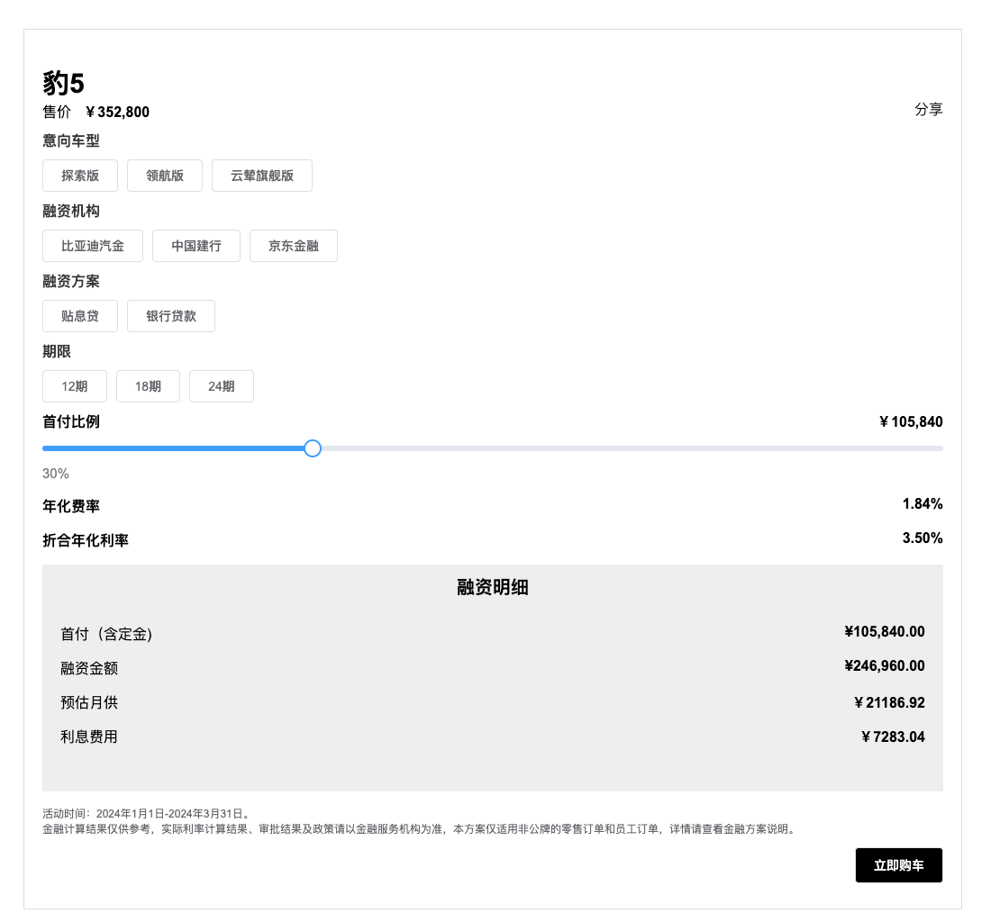

##### 5、参考文章

- [core-components-examples](https://aemcomponents.dev/content/core-components-examples/library/core-content/image.html#tabs-faf2870df5-item-a9a3c0f5b2-tab)
- [Build spa carousel](https://medium.com/@lucasfrancisconiflores/adobe-experience-manager-building-a-component-to-display-a-carousel-of-images-648448ca89be)
- [AEM SPA 组件映射](https://experienceleague.adobe.com/zh-hans/docs/experience-manager-learn/getting-started-with-aem-headless/spa-editor/react/map-components)
- [AEM core components](https://github.com/adobe/aem-core-wcm-components/blob/main/content/src/content/jcr_root/apps/core/wcm/components/image/v3/image/image.html)
- [Map SPA component](https://www.mavice.com/blog/map-spa-components-to-aem-components/)
- [Extend a Component](https://www.mavice.com/blog/extend-a-component/)
