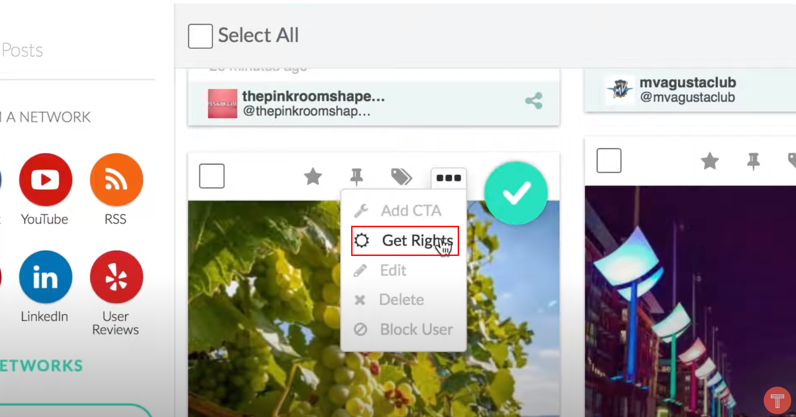

TINT
# Integrate UGC into Bynder via TINT

TINT helps marketers gain and manage the legal rights to user-generated content (UGC), and then distribute that content to marketing channels, e-commerce channels, and websites. 

- Aggregate UGC from across social media and curate to select the content best related to your brand.
- Use artificial intelligence and machine learning to source the best content.
- Easily send Rights Approved content from TINT into Bynder.
- No more need to download images and then re-upload them into your media libraries.

## 1. Aggregate UGC from across social media

When you have logged in to TINT, you can chose which social media you want to retrieve the UGC content. After you select the media, you can search with the tag from this social media. Then you can add the best asset to TINT.

### 1.1 Choose social media

### 1.2 Search Tag from Social media

 

### 1.3 Add assets to TINT

## 2. Manage UGC Rights

The UGC Rights Management can easily let you obtain original poster approval. Once approved by the user, UGC rights content is [stored in UGC Studio](https://www.tintup.com/ugc-studio) for easy organization, search, customization & editing, download, or to automatically integrate and send to other platforms in your tech stack like Bynder, Hootsuite, Salesforce, AEM, HubSpot, Marketo, Facebook Ads, and more.	

### 2.1 How to obtain rights to your content through UGC Rights

According to [official documentation](https://support.tintup.com/hc/en-us/articles/230883267-How-to-obtain-rights-to-your-content-through-UGC-Rights#h_01HNAAS6F8WEPW69JSCV1HP0ZB), UGC Rights is only available with **Instagram** and **Twitter**.  We may meet Rights issue for other social media.

## 3. Send UGC Media to Bynder

1. Make sure you're logged in to TINT.

2. Click the  **UGC Studio** button in the left sidebar in TINT.

3. Open the asset you want to send to Bynder and click the **Publish** button. Alternatively, you can select multiple assets on the overview screen and click the **Publish** button.

4. Open the **STEP 1: Select Account** dropdown and select the Bynder portal you want to send the asset to.

5. Open the **Steps 2: Select Folder** dropdown and select the Bynder brand you want to send the asset to.

   > Most Bynder portals only have one brand.

6. Click the **Publish** button to send the asset to Bynder.

The asset will be sent to the asset bank of the selected Bynder portal and tagged with the selected brand. The asset won't be sent to the waiting room. It may take a few minutes before the asset shows in the Asset Bank.

## 4. Content AI

TINT privode the most powerful engine to discover stunning visual content. More details for [Content AI](https://www.tintup.com/solutions/content-ai-machine-learning/).

### 4.1 Visual Search

Finding that perfect image is important. It’s also difficult. Frustrating. Time consuming.

TINT changes everything. Uncover the perfect content every time with industry-first visual search UGC technology.

Choose from existing UGC or upload an image to find visually similar content. TINT’s unique Visual Search analyzes a 2048 dimensional space, providing you content sets with similar tones, landscapes, settings, landmarks, and more.

### 4.2 UGC Recommendation Scoring

Take the guesswork out of moderating UGC through scoring. Easily filter to highlight the best content, quickly and concisely. TINT analyzes every post, providing you a recommendation score to save time and source content that follows brand guidelines.

### 4.3 Personalized Content Experiences

TINT constantly learns from your moderation actions to create a unique profile based on content preferences adding speed, depth, and scale to help you deliver riveting personalized content experiences across any channel.